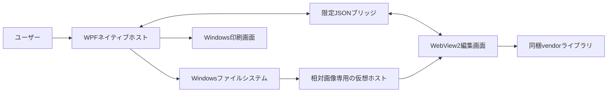

# Windowsポータブルアプリ設計

## 目的

Windowsアプリ版は、既存のWeb編集基盤を維持しながら、ファイル操作と印刷をWindows側へ移します。

これにより、ブラウザ版で必要だったFile System Access APIのフォルダ許可を、通常のWindows標準ダイアログへ置き換えます。

ユーザー登録、OAuth、Webサイトへのログインは導入しません。

## 構成

WPFネイティブホストは、メニュー、ツールバー、ウィンドウタイトル、絶対パス表示、ファイルダイアログ、未保存確認、印刷を担当します。

WebView2編集画面は、ProseMirror、CodeMirror、Markdownプレビュー、Mermaid、KaTeX、アウトライン、ローカル下書きを担当します。

両者は、許可した種類のJSONメッセージだけで通信します。

## 責務の境界

|操作|担当|補足|
|-|-|-|
|新規作成|WPF|未保存確認後に空文書をWebViewへ渡します。|
|Markdown読込|WPF|UTF-8、10MB以下、許可拡張子を検証します。|
|保存と別名保存|WPF|BOMなしUTF-8で保存します。|
|HTML書出し|WPF|WebViewが生成したHTMLをWindows標準ダイアログで保存します。|
|設定書出し|WPF|256KB以下のJSONだけを保存します。|
|画像保存|WPF|画像署名、MIME、25MB上限、保存名を検証します。|
|相対画像表示|WPFとWebView2|WPFが文書フォルダを画像専用仮想ホストへ割り当てます。|
|編集と描画|WebView2|既存のローカルWeb資産をそのまま使います。|
|下書き復元|WebView2|ポータブルデータフォルダ内のlocalStorageを使います。|
|印刷|WPF|WebView2の内容をWindowsのシステム印刷画面へ渡します。|

## ブリッジ

WebViewからネイティブ側へ送れる主なメッセージは次のとおりです。

* `desktop.ready` は、編集画面の初期化完了を通知します。
* `desktop.documentState` は、未保存状態と表示用ファイル名を通知します。
* `desktop.documentSnapshot` は、ネイティブ側が要求した現在のMarkdownを返します。
* `desktop.command` は、新規、開く、保存、別名保存、印刷のいずれかを要求します。
* `desktop.saveAsset` は、ユーザーが選択した画像をassetsフォルダへ保存するよう要求します。
* `desktop.resolveImageReferences` は、Markdownに含まれる絶対画像パスを現在の文書フォルダ内に限定して検査するよう要求します。
* `desktop.exportHtml` と `desktop.exportSettings` は、明示操作で生成した内容の保存を要求します。

ネイティブ側は、送信元が `https://portable-markdown-editor.local/` の場合だけメッセージを処理します。

ホストオブジェクトは無効化しているため、JavaScriptから任意の.NETメソッドを呼べません。

ネイティブ側は、現在の文書パス、フォルダ列挙結果、汎用ファイル読込関数をWebViewへ公開しません。

既存Markdownに絶対画像パスが含まれる場合は、最大64件をネイティブ側で検査します。

現在の文書フォルダ内に実在し、拡張子、ファイル署名、25MBの上限を満たすラスター画像だけを相対パスへ変換して返します。

## 仮想ホスト

アプリ資産は `https://portable-markdown-editor.local/` へ読み取り専用で割り当てます。

開いているMarkdownの親フォルダは `https://document.portable-markdown-editor.local/` へ割り当てます。

Web側は、安全な相対パスをURLセグメント単位でエンコードしてから、相対画像の `src` にだけ使います。

Content Security Policyは、この文書ホストを `img-src` にだけ追加し、`connect-src`、`script-src`、`object-src` では許可しません。

`..` を含む相対パス、文書フォルダ外のローカル絶対パス、文書フォルダ外のUNCパス、遠隔画像はブロックします。

## Windows側の検証

Markdownは `.md`、`.markdown`、`.txt` に限定します。

読込時は厳密なUTF-8として解釈し、10MBを上限とします。

保存時は改行をLFへ正規化し、BOMなしUTF-8で書き込みます。

画像はPNG、JPEG、GIF、WebPのバイト署名を検査し、ブラウザが報告したMIMEと一致する場合だけ保存します。

画像ファイル名はWindowsで無効な文字と予約名を無害化し、既存ファイルを上書きせず連番を割り当てます。

既存のassetsフォルダが再解析ポイントの場合は、意図しない場所への書込みを避けるため保存を拒否します。

## WebView2の制限

トップレベル遷移はアプリオリジンだけを許可します。

外部リンクは、Web側の許可ドメイン検証を通り、ユーザー操作で新しいウィンドウを要求した場合だけ既定ブラウザへ渡します。

WebView2の権限要求は、アプリオリジンからユーザー操作で要求されたクリップボード読取りを除いて拒否します。

DevToolsとホストオブジェクトは配布版で無効です。

WebView2のユーザーデータは `data/WebView2/` に置き、ポータブルフォルダ外へアプリ固有データを作らない構成です。

## ビルドと配布

利用者は、リポジトリの `release/PortableMarkdownEditor-win-x64.zip` を展開し、`PortableMarkdownEditor.exe` を起動します。

配布先にVisual Studio、Visual Studio Installer、MSBuildは不要です。

`BuildPortableWindows.cmd` は、導入済みのVisual Studio Build ToolsとWebView2 SDKを探索します。

このスクリプトは開発者がソースから配布物を作るためのものであり、利用者がアプリを起動するためのものではありません。

ネットワーク取得、NuGet復元、npm実行は行いません。

ビルド後は、WPFアプリ、WebView2 SDK DLL、x64 Loader、Web資産、ライセンス表示を一つのフォルダへまとめます。

配布物はフォルダまたはZIPのままコピーして実行できます。

`BuildPortableWindows.cmd -Publish` は、完成済みZIPを `release/` へコピーし、`SHA256SUMS.txt` を更新します。

WebView2 Evergreen Runtimeと.NET Framework 4.8はOS側の実行条件であり、配布フォルダには含めません。

## 残る制限

単一EXEではありません。

WebView2 Evergreen RuntimeがないPCでは起動できません。

Windows x64以外は現在のビルド対象外です。

Windowsストア配布、コード署名、自動更新、ファイル関連付けは実装していません。

コード署名がないため、別PCへ配布した場合はWindows SmartScreenが未認識アプリとして警告する可能性があります。

組織配布で警告を減らすには、発行者証明書によるコード署名と配布手順の整備が別途必要です。
