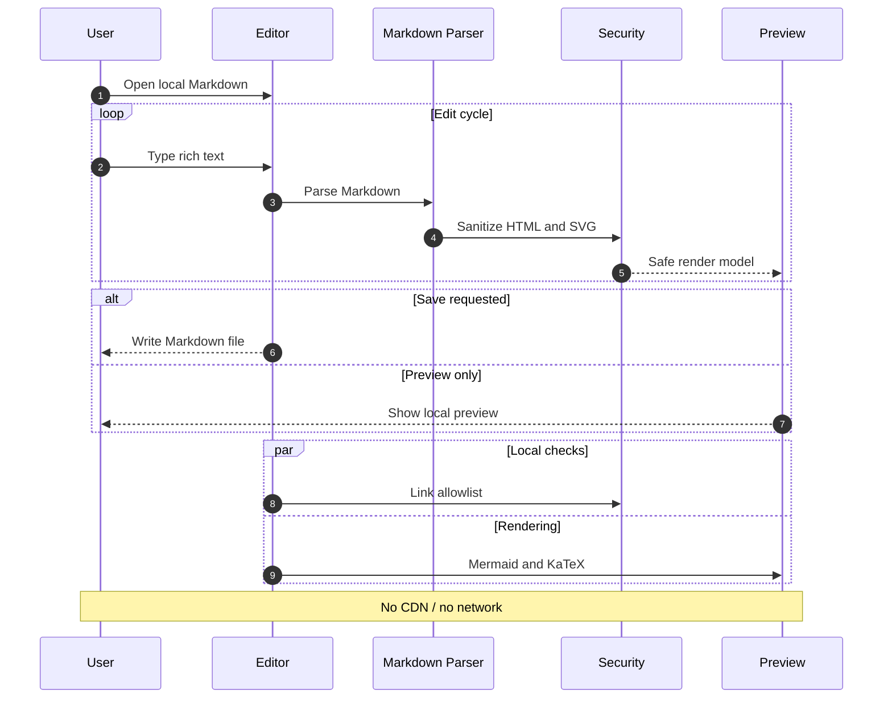
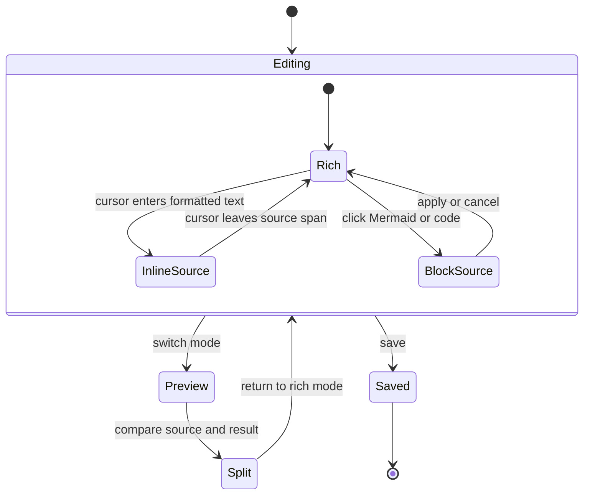
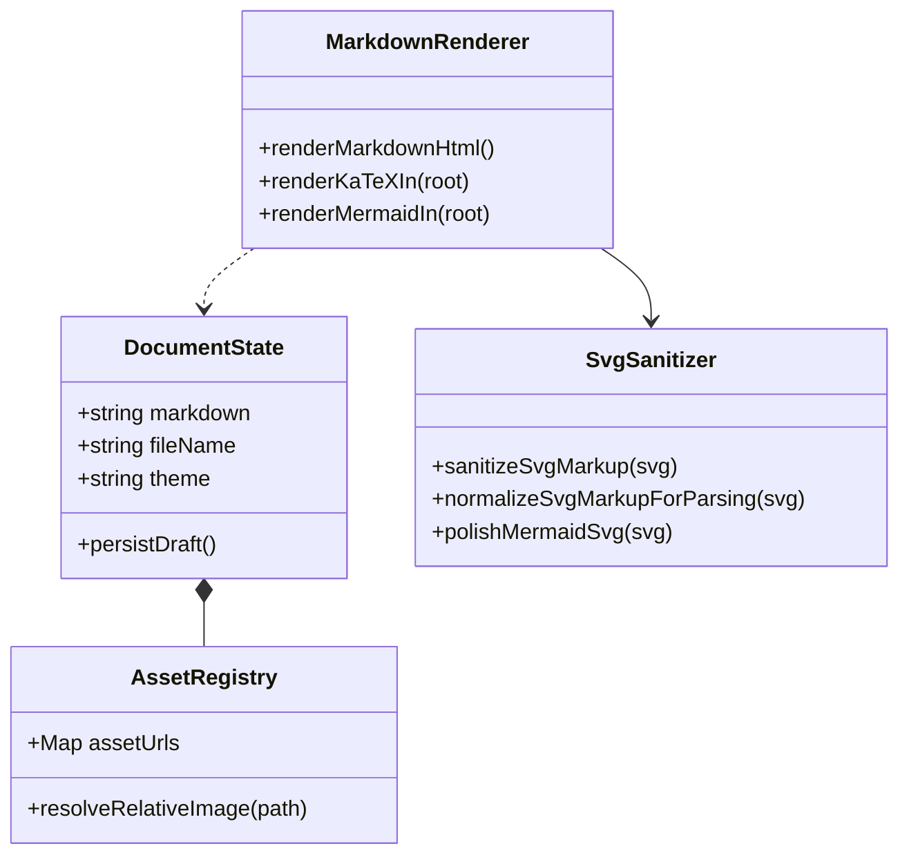
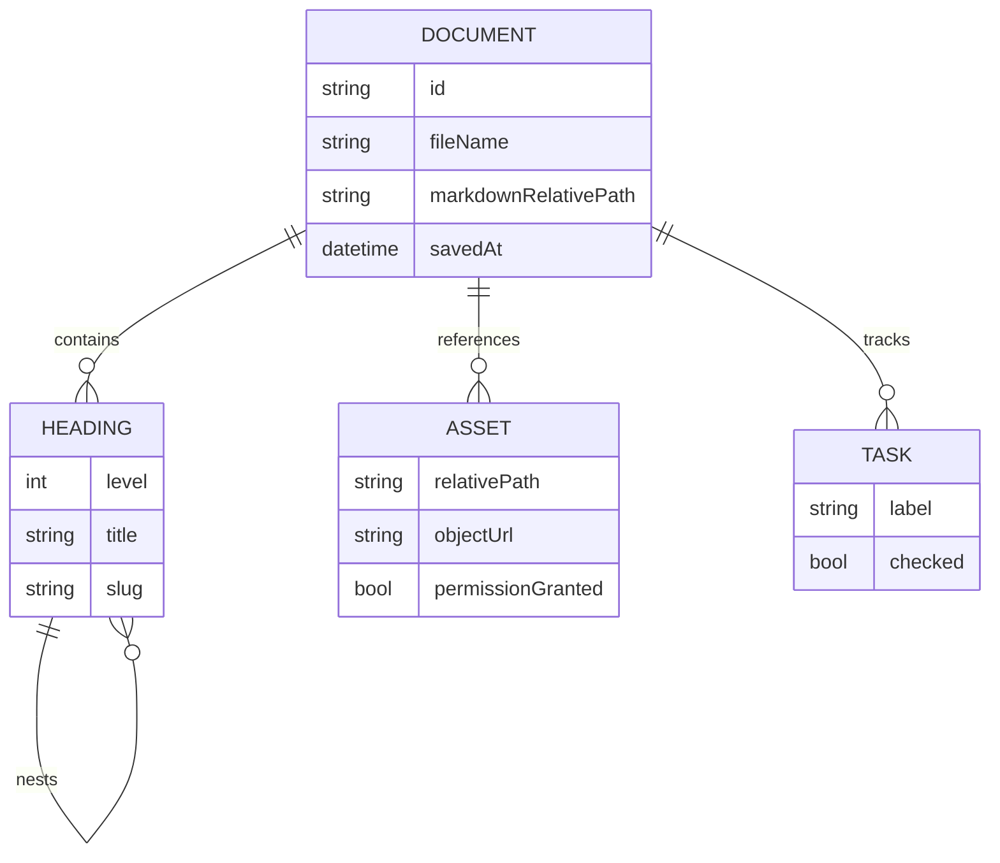
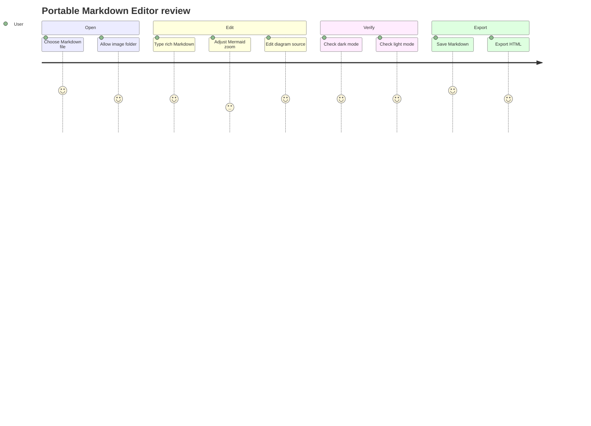
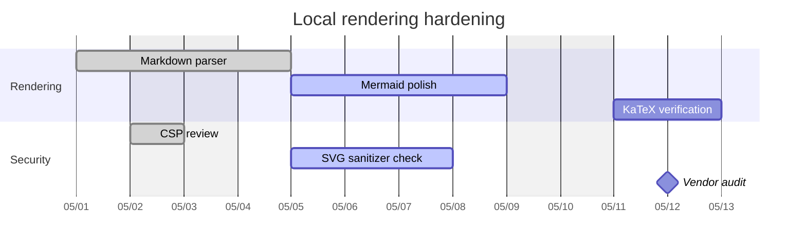
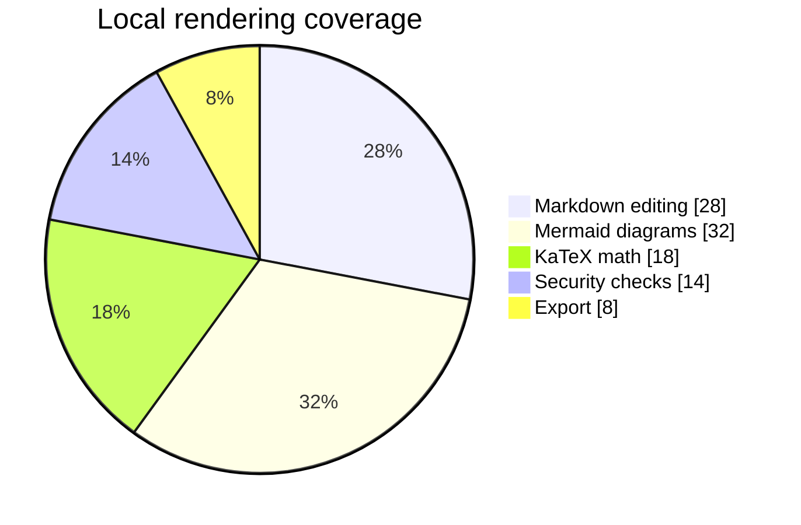
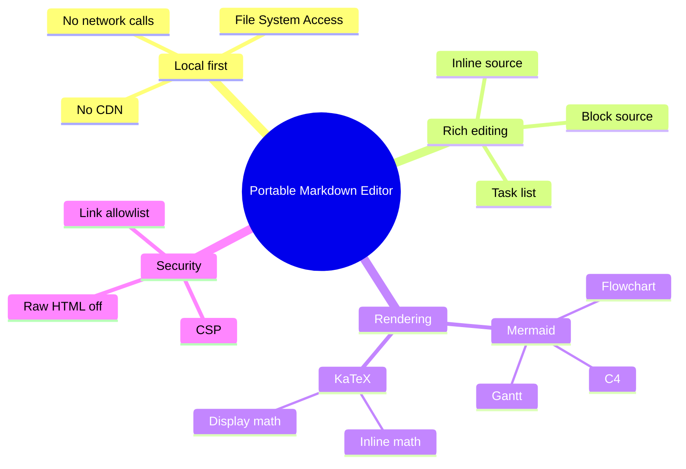
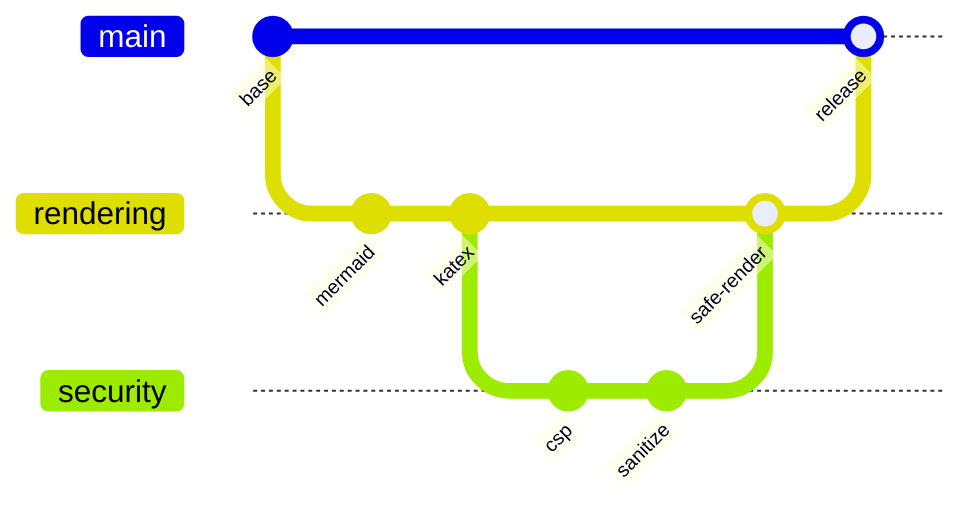
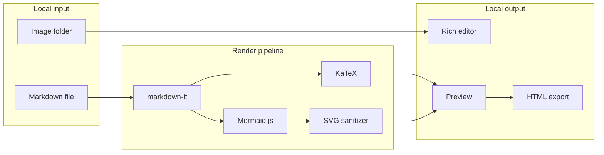

# Mermaid 詳細ギャラリー

[toc]

## 概要

この文書は Mermaid の基本図種に少し複雑なケースを加えた表示確認用サンプルです。

- sequenceDiagram: loop / alt / par / note
- stateDiagram-v2: nested state
- classDiagram: inheritance / composition / dependency
- erDiagram: attributes / cardinality
- journey: score lanes
- gantt: milestones / active / done
- pie: multiple colors
- mindmap: nested branches
- gitGraph: branch / checkout / merge

## Sequence Advanced

## State Nested

## Class Relationships

## ER Document Model

## User Journey

## Gantt With Milestones

## Pie Distribution

## Mindmap Deep

## Git Graph Branches

## Mixed Flow

