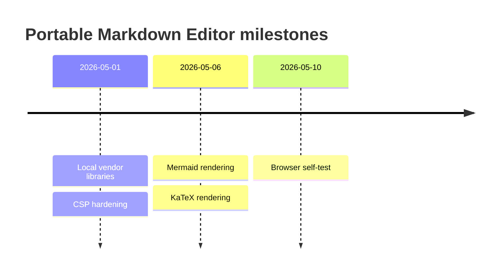
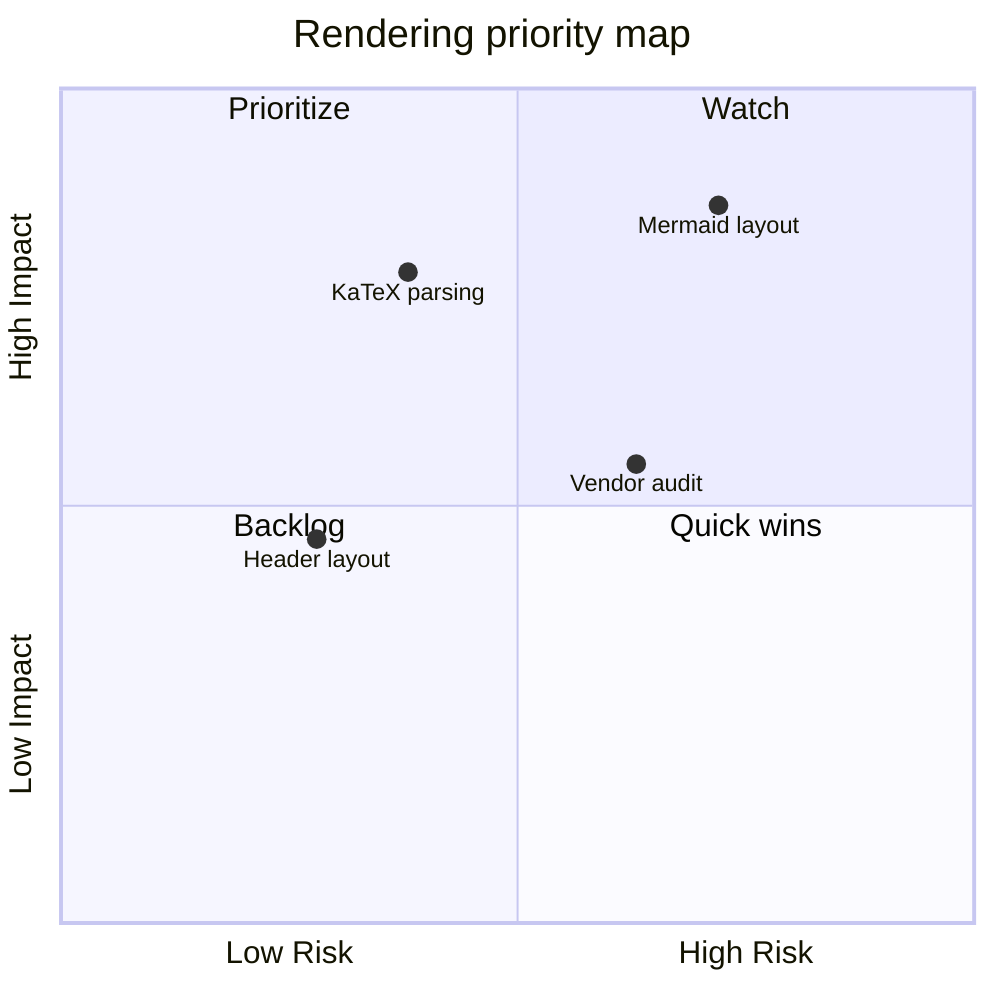
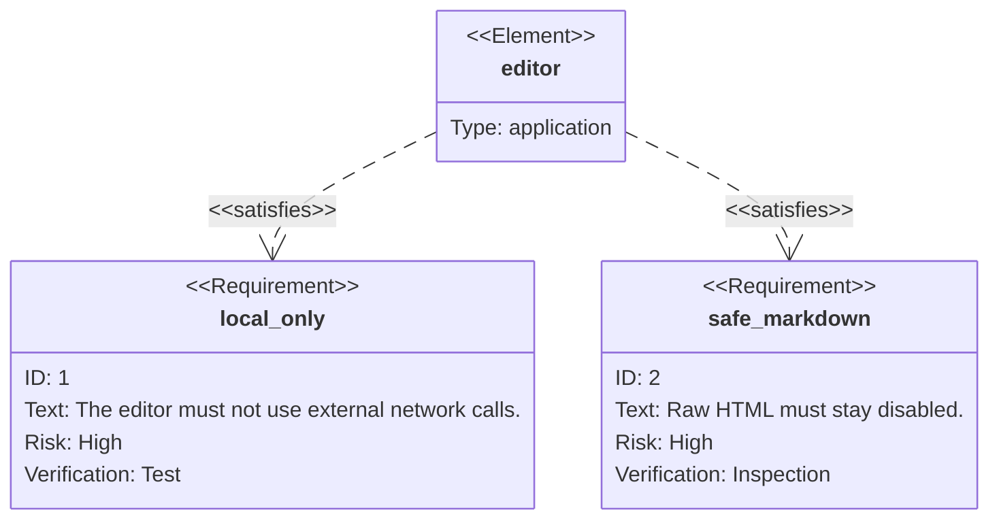
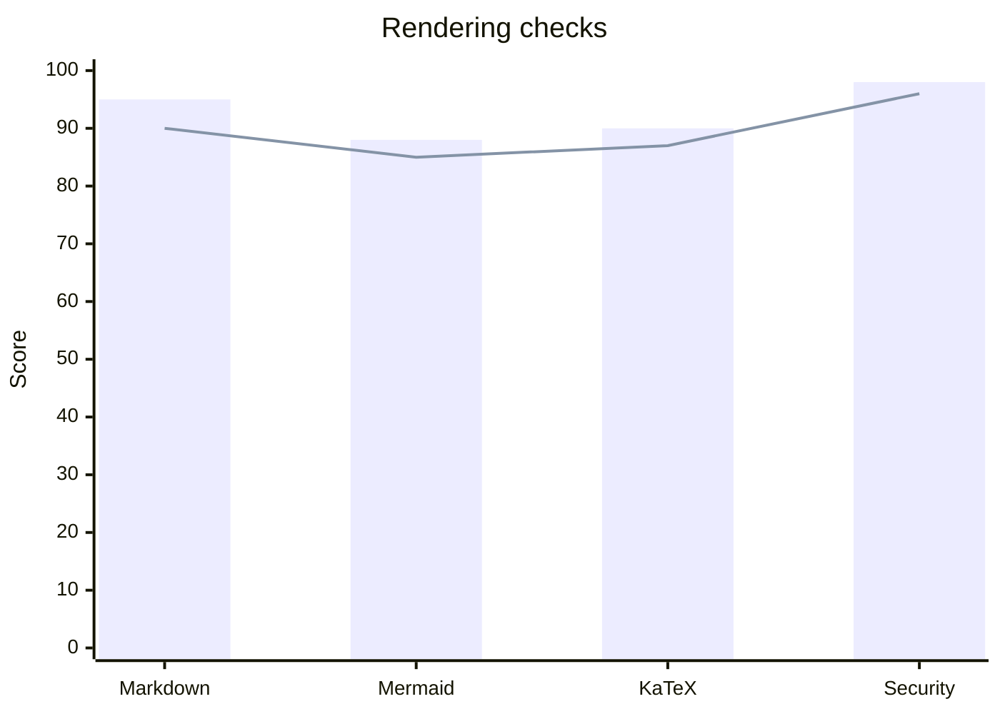
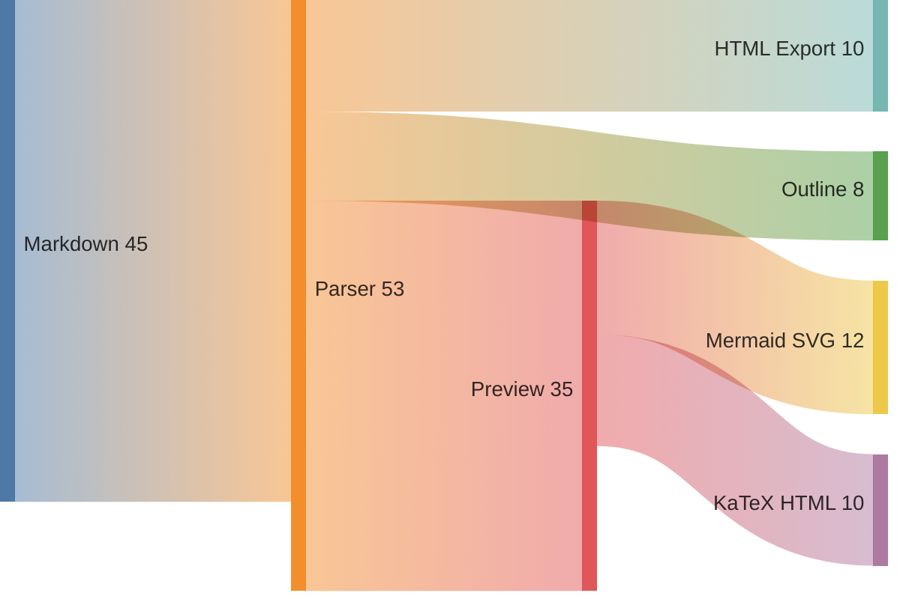
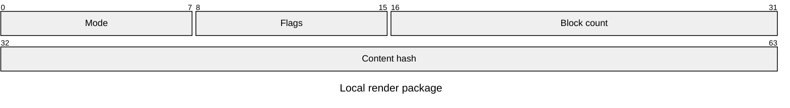
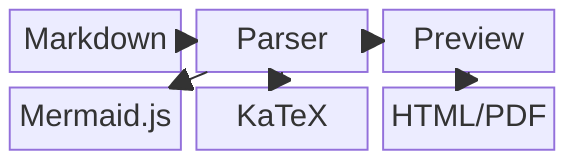
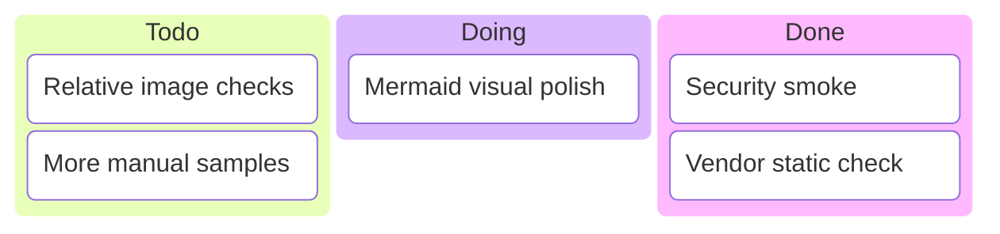
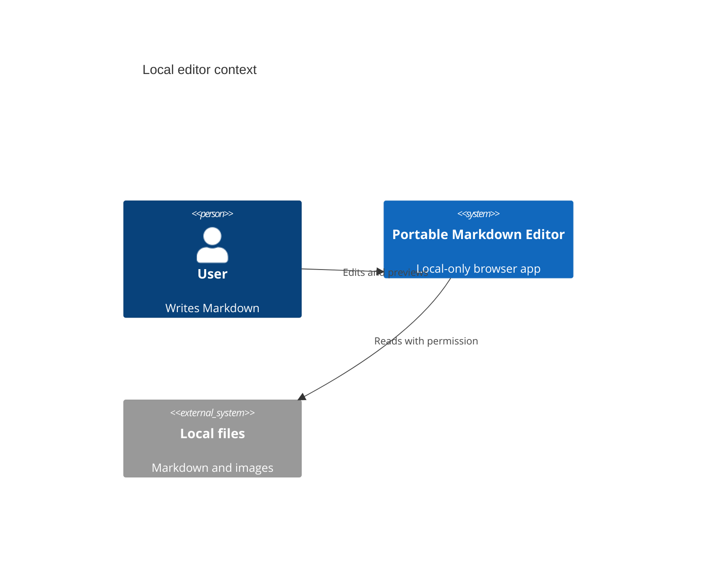
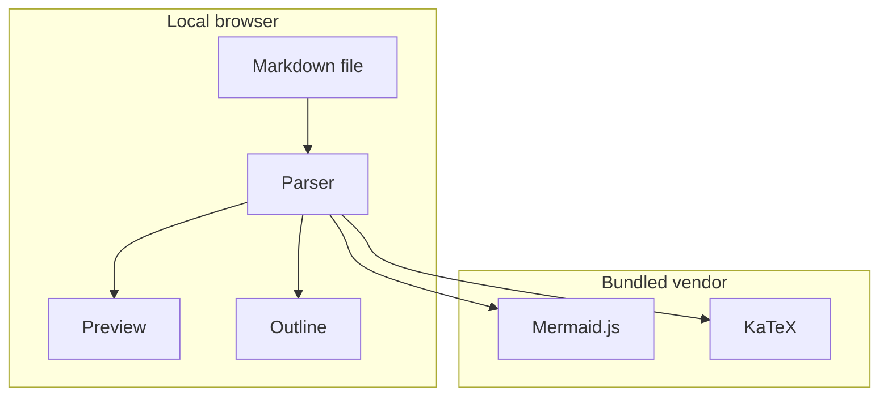

# Mermaid 追加ギャラリー

[toc]

## 概要

この文書は Mermaid の追加構文をまとめた表示確認用サンプルです。

- timeline
- quadrantChart
- requirementDiagram
- xychart-beta
- sankey-beta
- packet-beta
- block-beta
- kanban
- C4Context
- flowchart subgraph

## Timeline

## Quadrant Chart

## Requirement Diagram

## XY Chart

## Sankey

## Packet

## Block

## Kanban

## C4 Context

## Flowchart Subgraph

