# Mermaid / KaTeX 表示サンプル

[toc]

## 概要

この文書は Mermaid と KaTeX の表示確認用サンプルです。

- Mermaid: flowchart / sequence / class / state / ER / journey / gantt / pie / mindmap / gitGraph
- KaTeX: inline math / display math / aligned / matrix / cases / summation / integral
- Markdown 内 HTML は使いません。

## KaTeX inline

文章中の数式: $E = mc^2$、$a^2 + b^2 = c^2$、$\alpha + \beta = \gamma$。

確率の例: $P(A \mid B) = \frac{P(B \mid A)P(A)}{P(B)}$。

## KaTeX display

$$
\int_{-\infty}^{\infty} e^{-x^2} dx = \sqrt{\pi}
$$

$$
\sum_{k=1}^{n} k = \frac{n(n+1)}{2}
$$

## KaTeX aligned

$$
\begin{aligned}
f(x) &= ax^2 + bx + c \\
f'(x) &= 2ax + b \\
x &= \frac{-b \pm \sqrt{b^2 - 4ac}}{2a}
\end{aligned}
$$

## KaTeX matrix

$$
\begin{bmatrix}
1 & 2 & 3 \\
4 & 5 & 6 \\
7 & 8 & 9
\end{bmatrix}
\begin{bmatrix}
x \\
y \\
z
\end{bmatrix}
=
\begin{bmatrix}
14 \\
32 \\
50
\end{bmatrix}
$$

## KaTeX cases

$$
f(x)=
\begin{cases}
x^2 & x \ge 0 \\
-x & x < 0
\end{cases}
$$

## Mermaid flowchart TD

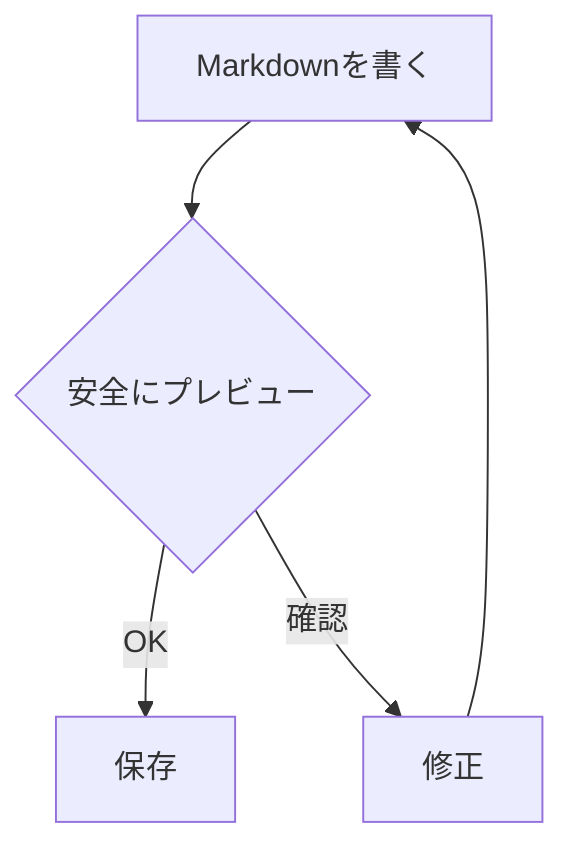

## Mermaid flowchart LR

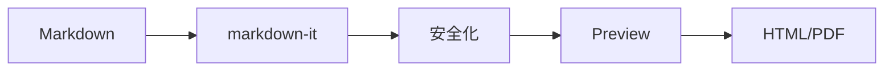

## Mermaid sequence

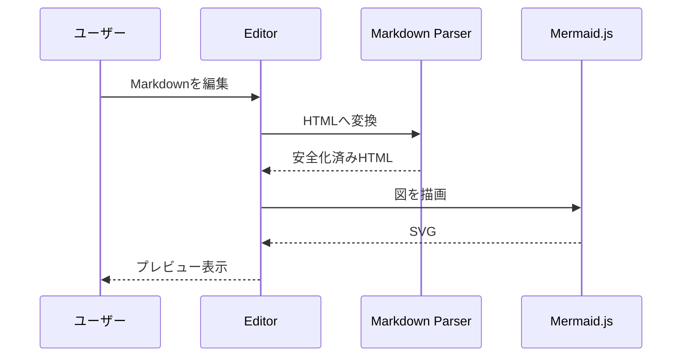

## Mermaid class

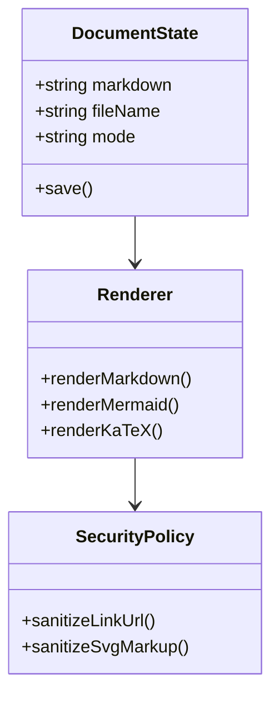

## Mermaid state

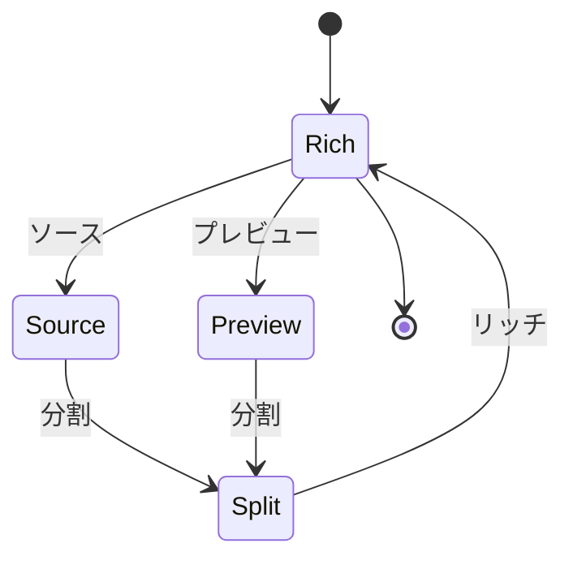

## Mermaid ER

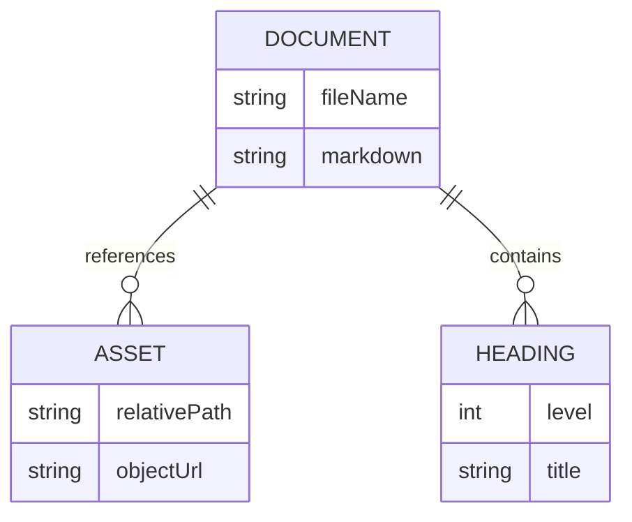

## Mermaid journey

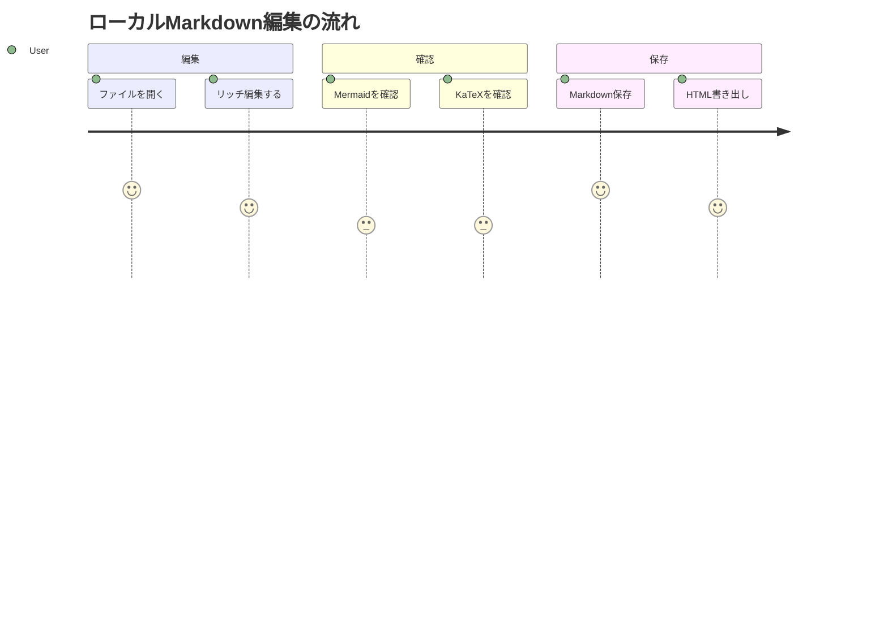

## Mermaid gantt

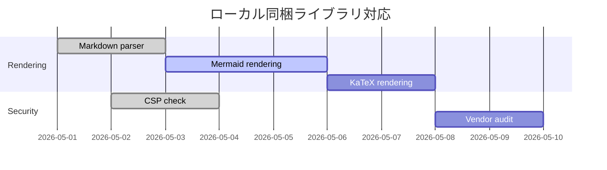

## Mermaid pie

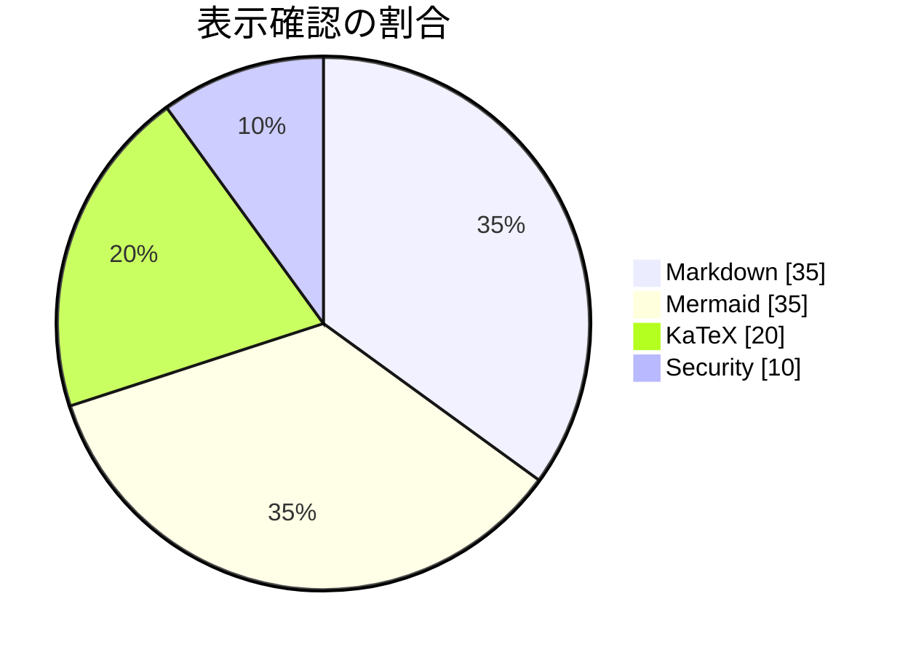

## Mermaid mindmap

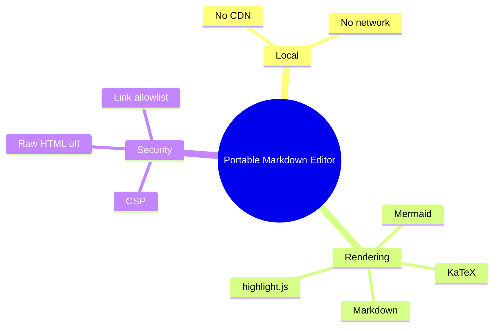

## Mermaid gitGraph

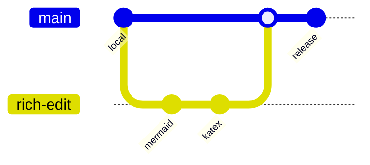

## 混在確認

Mermaid 図の前後に inline math $x_{n+1}=x_n-\frac{f(x_n)}{f'(x_n)}$ があるケースです。

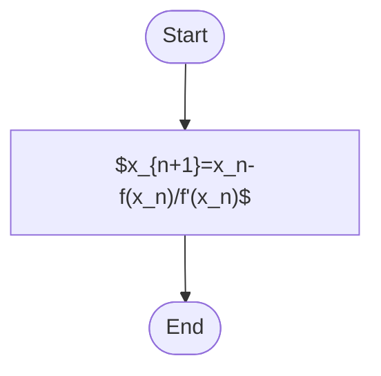

最後に display math を置きます。

$$
\lim_{n \to \infty}\left(1+\frac{1}{n}\right)^n = e
$$
