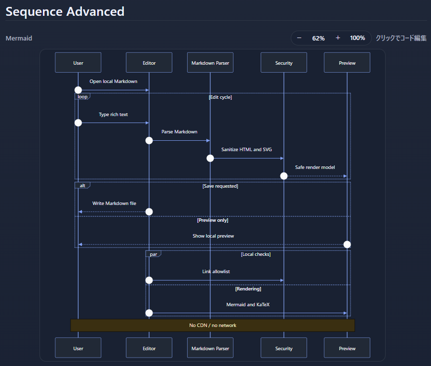
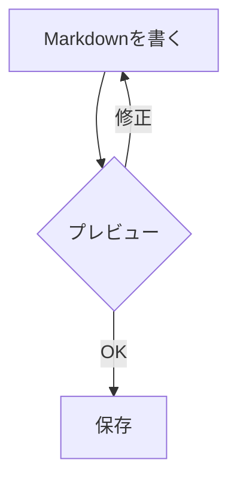

# サンプル文書

[toc]

## 概要



これは Portable Markdown Editor のサンプルです。

- **太字**
- *斜体*
- ~~取り消し線~~
- `inline code`

## 表

| 項目 | 状態 |
| --- | --- |
| ローカル動作 | OK |
| HTMLエスケープ | OK |
| PDF/印刷 | OK |

## チェックリスト

- [x] ZIPを展開
- [x] index.htmlを開く
- [ ] 自分のMarkdownを書く

## コード

```js
console.log('完全ローカルで動作します');
```

```python
def greet(name: str) -> str:
    return f"Hello, {name}"
```

## Mermaid


